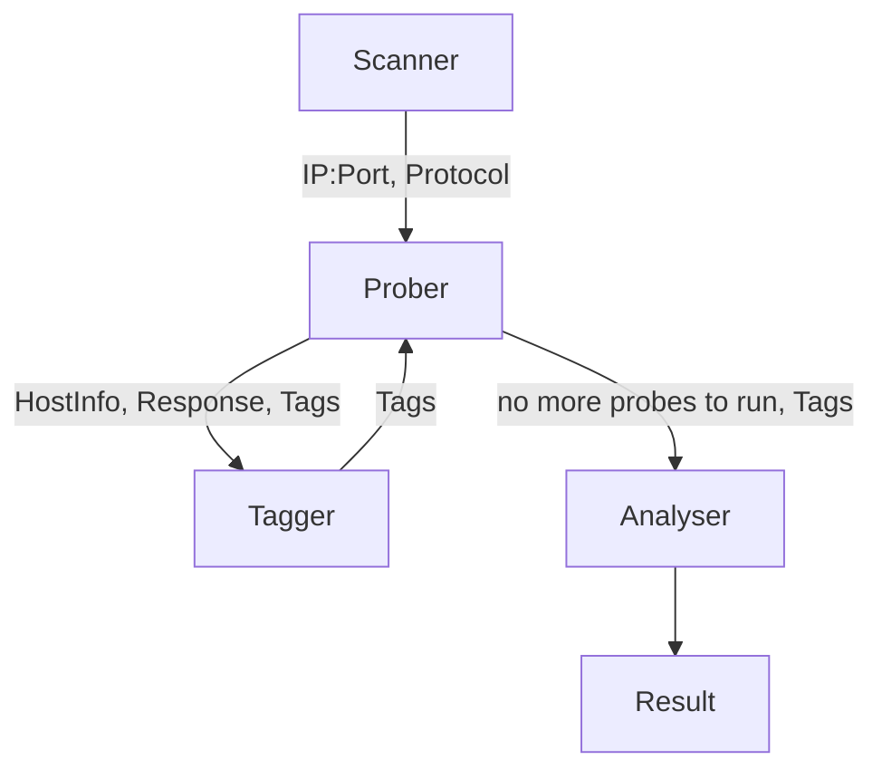

```
Tag: [[value], [marjorValue, minorValue], ...]
	[[proto_http], [serv_nginx, ver_1919.810], [serv_WordPress, ver_114.514]]

HostInfo: {address: ip, port: int, protocol: tcp/udp, path?: string, ...}
	{address: 192.168.1.1, port: 8080, protocol: tcp, path: /}
	
Response: Buffer/string
	"HTTP/1.1 OK\r\n ... <html>..."

Prober: probe.tags.belongsTo(input.tags)

Probe: (HostInfo, Tags)-> {HostInfo, Response, Tags}
	According to given tags, run matching probe script, send matching payload to specific Host, 
get Response for Tagger

Tagger: (HostInfo, Response, Tags)-> Tags
	Iterate check script, find matching Tag according to Response, give back to Prober

More Tags -> Less search possiblity

Analyser: (Tags)-> Result
	Once Prober finish all the probe script, return all the tag to analyser

```

#### 设计思想

使用流模型，最大化程序效率，方便解耦并发。

分为 

1. 扫描存活/端口开放（Scanner）
2. 根据 Tag 主动交互（Prober）
3. 交互结果分析，打 Tag（Tagger）
4. Tag 综合分析（Analyser）

四部分，其中 2、3 为一反馈循环。

Scanner 在扫描出存活机器的开放端口后，将主机、端口发送给 Prober。

Prober 基于已有的基础 Tag 寻找匹配交互脚本，然后并发执行。脚本们的交互结果分别传至 Tagger 进行分析，Tagger 基于已有 Tag 寻找分析脚本，并发分析。

分析结果（新的 Tag）会反馈给 Prober，Prober 再基于增加后的 Tags 进行交互，之后再 Tagger 分析，直到没有可以进行的交互脚本和分析脚本为止。

Prober 和 Tagger 进行脚本选择时，选择所有具有给出 Tags 的子集的脚本，即选择的脚本具有的 Tags 是目标 Tags 的子集，如给出 [protocol:tcp, protocol:http] 的 Tag，可以匹配具有 [protocol:tcp] 的脚本，但不能匹配  [protocol:tcp, protocol:ssh] 的脚本， 并按相关度排序，一个脚本对相同目标不会重复执行。

Tags 结果返回给 Analyser 进行分析汇总，其中包括 Tags 合并为准确的软件信息，设备信息等。
